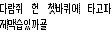

# HanBit

Hangul Bitmap Generator, sort of

`node ./hanbit.js -x 8 -y 16 -i ./example.png -o example-output.png`

`node ./hanbit.js -x 8 -y 16 -i ./example.png -o quote.png "목마른 사람이 우물 판다"`

The `stdin` can be redirected to this script, for example:

`node ./hanbit.js -x 8 -y 16 -i ./example.png -o input-redirection.png < input.txt`

`cat input.txt | node ./hanbit.js -x 8 -y 16 -i ./example.png -o input-redirection.png`

Characters that are not in "Hangul Syllables" Unicode block (i.e. outside `U+AC00..D7A3`) will be replaced with a whitespace.

## Initiation

`npm i && npx tsc ./hanbit.ts`
